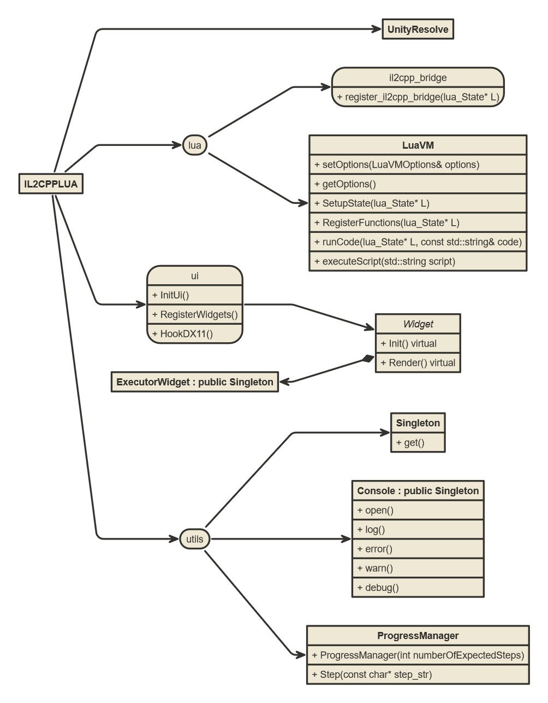

# sandbox branch
This is where i'm attempting to implement complicated features such as auto completing, lua type resolution, lua hooking

# IL2CPP Lua
Lua Implementation of UnityResolve.hpp
Opens an UI in game where you can write luau scripts

# Building
```
git clone https://github.com/ElCapor/Il2CppLuau.git --recursive
cd Il2CppLuau
xmake
```
# UML Diagram
Represents the current architecture of the project.

```
// conventions
// <state> = namespace
// <abstract> = virtual class
// + method
// only exposed & public functions are documented
```
